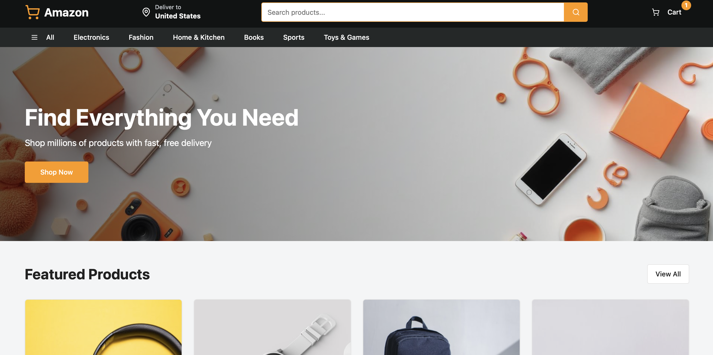
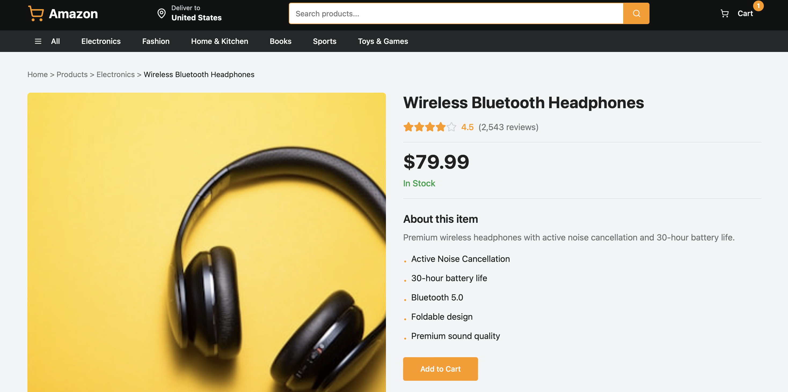
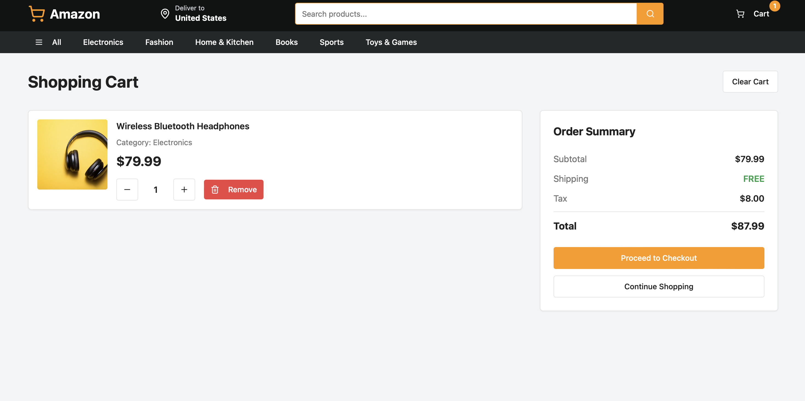

# E-Commerce Frontend

A modern e-commerce application built with React, TypeScript, and Vite.

## Screenshots

### Home Page

*Amazon-style homepage with hero banner, navigation menu, and featured products section*

### Product Detail Page

*Product page showing Wireless Bluetooth Headphones with ratings, pricing, features, and add to cart functionality*

### Shopping Cart

*Shopping cart with order summary, quantity controls, and checkout options*

## Recent Updates

### ✅ Completed Tasks
- **Added comprehensive README**: Documented features, tech stack, setup instructions, and project structure
- **Custom branding**: Created custom favicon with Amazon-style design (orange #FF9900, dark #232F3E)
- **Screenshots**: Added application screenshots showing homepage, product detail, and shopping cart pages
- **Optimized build configuration**: Using Vite with SWC for fast compilation and development
- **Successfully deployed**: Frontend running on Vite dev server at http://localhost:8080

## Preview

The application features:
- Amazon-style branding with orange accents
- Search functionality and shopping cart
- Navigation menu with categories (Electronics, Fashion, Home & Kitchen, Books, Sports, Toys & Games)
- Hero banner with "Find Everything You Need" headline
- Featured products section
- Responsive design

## Features

- 🛒 Shopping cart functionality
- 📱 Responsive design
- 🎨 Modern UI with Tailwind CSS and shadcn/ui components
- ⚡ Fast development with Vite
- 🔍 Product search and filtering
- 📦 Product categories (Electronics, Fashion, Home & Kitchen, Books, Sports, Toys & Games)

## Tech Stack

- **React 18** - UI library
- **TypeScript** - Type safety
- **Vite** - Build tool and dev server
- **Tailwind CSS** - Utility-first CSS framework
- **shadcn/ui** - Re-usable component library
- **React Router** - Client-side routing
- **Radix UI** - Accessible UI primitives

## Getting Started

### Prerequisites

- Node.js 18+ (LTS recommended)
- npm or pnpm or bun

### Installation

1. Install dependencies:

```bash
npm install
```

2. Start the development server:

```bash
npm run dev
```

The app will be available at `http://localhost:8080`

### Build for Production

```bash
npm run build
```

### Preview Production Build

```bash
npm run preview
```

## Project Structure

```
FrontEnd/
├── src/
│   ├── components/     # Reusable UI components
│   │   └── ui/        # shadcn/ui components
│   ├── contexts/      # React contexts (CartContext)
│   ├── data/          # Sample data
│   ├── hooks/         # Custom React hooks
│   ├── lib/           # Utility functions
│   ├── pages/         # Page components
│   ├── App.tsx        # Main app component
│   └── main.tsx       # App entry point
├── public/            # Static assets
└── index.html         # HTML template
```

## Available Scripts

- `npm run dev` - Start development server
- `npm run build` - Build for production
- `npm run build:dev` - Build in development mode
- `npm run lint` - Run ESLint
- `npm run preview` - Preview production build

## License

MIT
